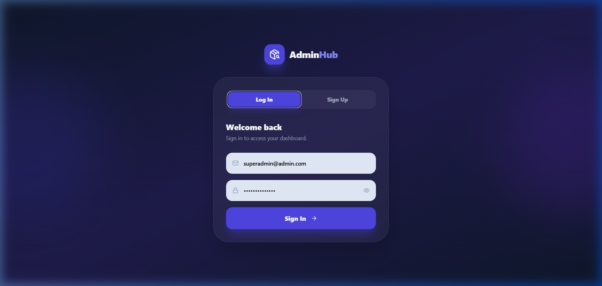
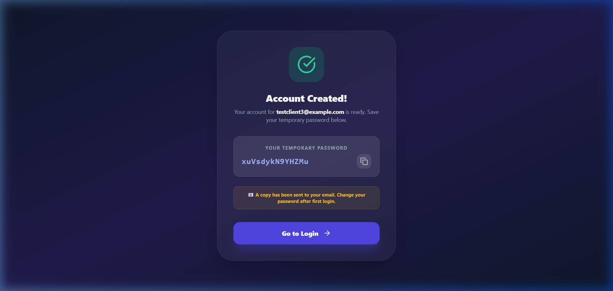
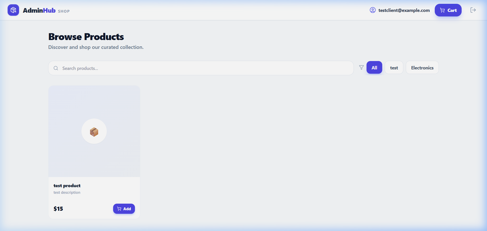
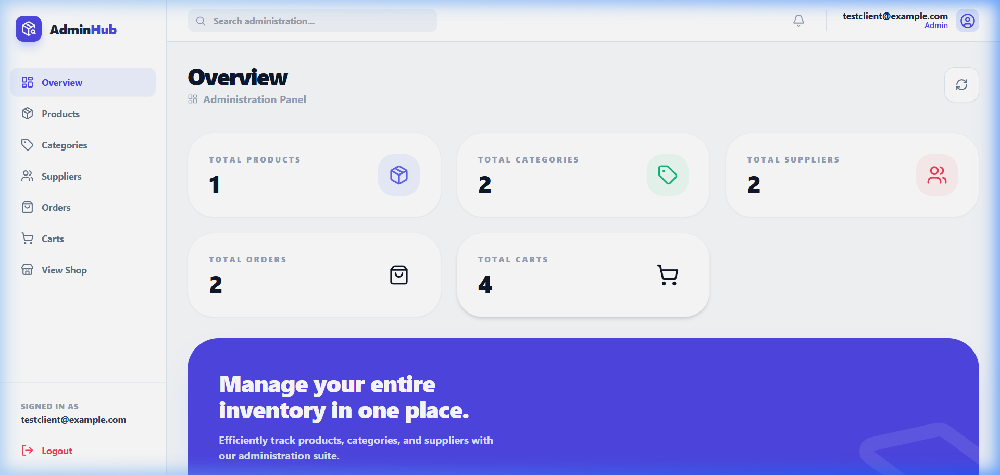
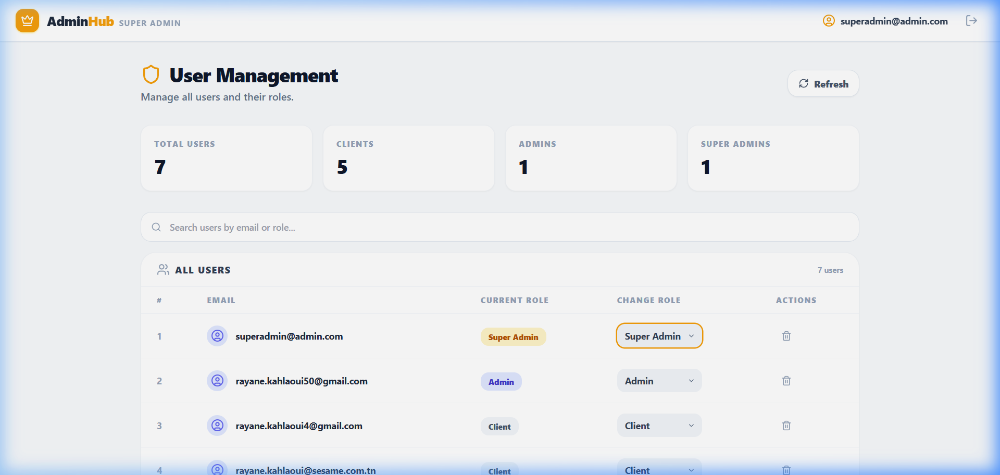

# Inventory Management & E-commerce Suite

A robust, full-stack application featuring an automated inventory management system and a integrated client shopping experience. Built with a modern microservices-ready architecture using Spring Boot and React.

## 🚀 New: Authentication & Authorization
The system now features a secure, custom authentication layer with **Role-Based Access Control (RBAC)**:

- **Clients**: Default role for new users. Can browse products, manage a local persistent cart, and place orders (requires login).
- **Admins**: Manage the core inventory data (Products, Categories, Suppliers, Orders).
- **Super Admins**: Oversee the entire system, including user management and role assignments.

### Security Features
- **BCrypt Hashing**: All passwords are salted and hashed for security.
- **Secure Token Sessions**: UUID-based session tracking for simplified secure access.
- **Automated Signup**: New users are assigned a strong, randomized password instantly displayed on screen and sent via email.
- **Secret Management**: Sensitive configurations are kept in a local `.env` file, excluded from version control for maximum security.

## 🛠 Tech Stack

- **Backend**: Spring Boot (Java 17), MySQL, Spring Mail, jBcrypt
- **Frontend**: React 19, Tailwind CSS, Lucide Icons, React Router 7
- **Infrastructure**: Docker, Docker Compose

## 📦 Project Structure

- `/TP1Category`: Spring Boot backend (Core logic, Auth Service, Unified Controllers).
- `/ecommerce-frontend`: React frontend (Auth Context, Dashboard components, Shop view).
- `docker-compose.yml`: Orchestration for frontend, backend, and MySQL services.

## 🏁 Getting Started

1. **Clone the repository**.
2. **Setup Secrets**: Create a `.env` file in the root directory:
   ```env
   # Mail credentials for signup notifications
   MAIL_USERNAME=your-email@gmail.com
   MAIL_PASSWORD=your-app-password
   ```
3. **Launch with Docker**:
   ```bash
   docker-compose up -d --build
   ```
4. **Access the Application**:
   - **Frontend**: http://localhost:3000
   - **Default Super Admin**: `superadmin@admin.com` / `SuperAdmin123!`

---

## 📸 Visual Gallery

### Authentication & Access
- **Login/Signup Interface**

- **Secure Signup Success**

- **Email Notification**


### Dashboards
- **Client Shop (E-commerce)**

- **Admin Inventory Dashboard**

- **Super Admin User Management**


### Management Interfaces
- **Order & Cart Logic**

- **Product & Category Entry**


---

## 📜 Key Features

- **Automated Inventory Tracking**: Real-time stats on products, categories, and suppliers.
- **Dynamic Order Creation**: Multi-selection interface for building customer orders.
- **Persistent Cart System**: Local storage prevents data loss for unauthenticated clients.
- **User Role Management**: Super Admins can promote/demote users directly through the UI.
- **Automated Email Flow**: Secure password delivery for new account creations.

