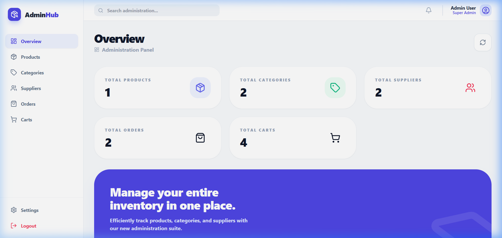
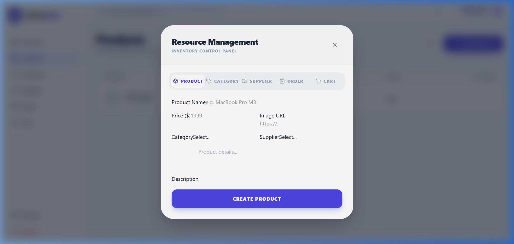
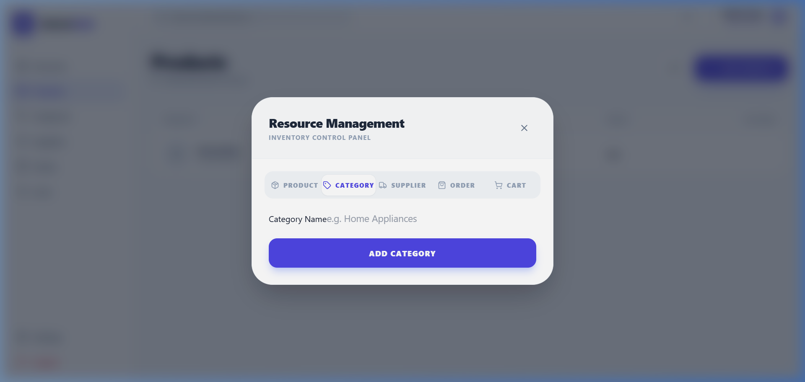
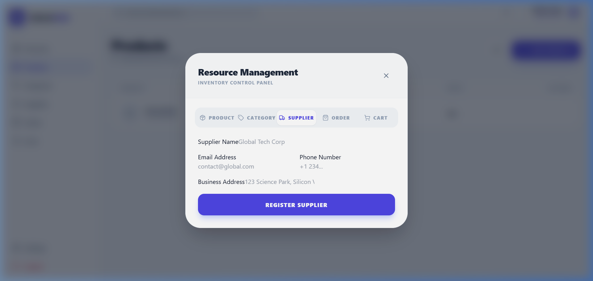
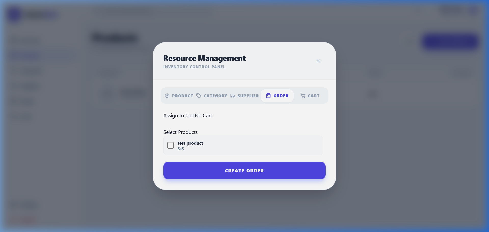
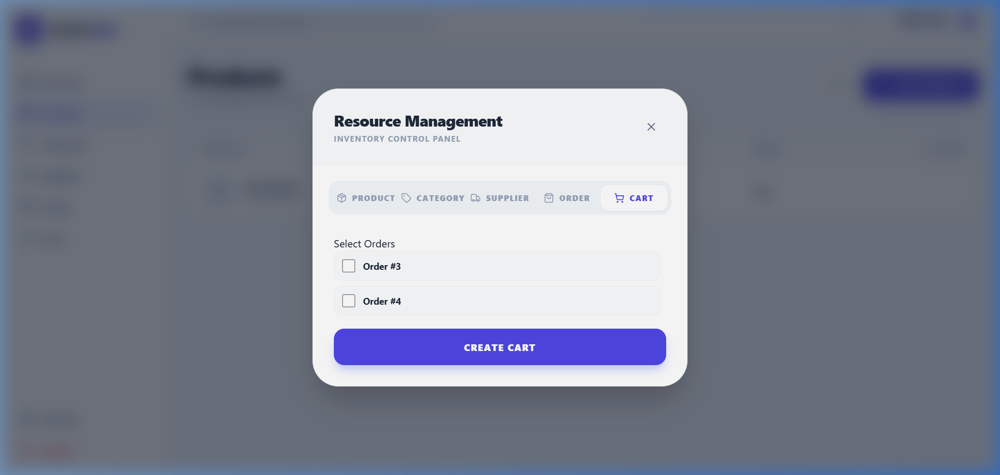

# Inventory Management Admin Dashboard

A full-stack application for managing products, categories, and suppliers with a modern admin interface.

## Tech Stack

- Backend: Spring Boot (Java 17), MySQL
- Frontend: React, Tailwind CSS, Lucide Icons
- Infrastructure: Docker, Docker Compose

## Prerequisites

- Docker Desktop installed and running.

## Getting Started

1. Clone the repository to your local machine.
2. Open a terminal in the project root directory.
3. Run the following command to build and start the containers:

   docker-compose up -d --build

4. The application will be available at the following URLs:

   - Frontend: http://localhost:3000
   - Backend API: http://localhost:8080

## Features

- Admin Overview: High-level statistics of inventory, including active orders and carts.
- Product Management: CRUD operations for products including image URL support.
- Category Management: Organization of products into categories.
- Supplier Management: Tracking of supplier contact information and links to products.
- Order Management: Create orders and dynamically assign multiple products using a modern visual selection interface.
- Cart Management: Group logic for nesting and associating multiple active orders to dedicated cart buckets.
- Responsive Design: Clean and functional admin dashboard built with Tailwind CSS.

## Project Structure

- /TP1Category: Spring Boot backend source code and Dockerfile.
- /ecommerce-frontend: React frontend source code and Dockerfile.
- docker-compose.yml: Orchestration of the frontend, backend, and database services.

## Screenshots

### Dashboard Overview

### Product Creation Interface

### Category Creation Interface

### Supplier Creation Interface

### Order Creation Interface

### Cart Grouping Interface

